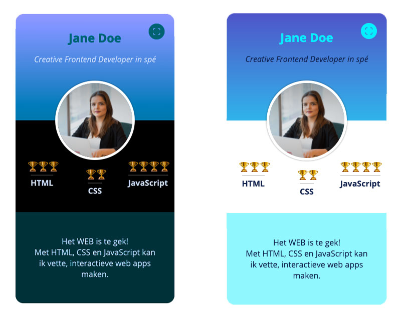

# Your Tribe - CSS Basics

Experimenteren met CSS; pas met behulp van CSS Basics wijzigingen toe op je visistekaartje

## Context

Deze leertaak hoort bij sprint 1 Your Tribe. Dit is een deeltaak die je individueel uitvoert.

In het college S01W1-04 CSS Basics wordt behandeld hoe je CSS Selectoren en properties kan toepassen om een bestaand visitekaartje aan te passen.

## Doel van deze opdracht

Je leert hoe je experimenteren met (nieuwe) CSS features en daarmee (on)mogelijkheden van CSS beter kennen.

## Werkwijze

Deze opdracht gaat over deze fases van de DLC: [ontwerpen](#ontwerpen), [bouwen](#bouwen) en [integreren](#integreren) 

### Ontwerpen
In de workshop *CSS Basics* heb je een aantal inspirerende voorbeelden gezien van wat mogelijk is met CSS. Ontwerp en maak een nieuwe versie van je visitekaartje en probeer hierbij, net als bij de voorbeelden is gedaan, out-of-the-box te denken. 

#### Aanpak

1. Maak een nieuwe schets van je visitekaartje met een aantal css erin die je vandaag hebt gezien (typo, shadow, round corners, blend modes, .. )
2. Maak een breakdown schets en schrijf op hoe je de vormegving met css kan maken

#### Materiaal 

- [CSS Text Effects](https://freefrontend.com/css-text-effects/)
- [Card Stack Effects](https://tympanus.net/codrops/2015/10/28/effect-ideas-for-card-stacks/)
- [Creative Link Effects](https://tympanus.net/codrops/2013/08/06/creative-link-effects/)
- [About GitHub Wikis](https://docs.github.com/en/communities/documenting-your-project-with-wikis/
about-wikis)
- [Breakdownschets voorbeeld]() 

### Bouwen
In de bouwfase werk je jouw gekozen schets, zo goed mogelijk, uit in HTML, CSS en eventueel JavaScript. Doe dit aan de hand van de breakdownschets.

#### Aanpak
1. Open de geforkte repository folder in je code editor naar voorkeur (tip: momenteel gebruiken de meeste docenten [Visual Studio Code](https://code.visualstudio.com/))
2. Bekijk onderstaande bronnen en zoek uit welke CSS properties je nodig hebt om jou schets uit te kunnen werken
3. Pas deze CSS properties aan of voeg ze toe aan de CSS stylesheet
4. Varieer in de CSS selectoren die je gebruikt (probeer CSS classes te voorkomen)

#### Materiaal 

- [MDN Styling Text](https://developer.mozilla.org/en-US/docs/Learn/CSS/Styling_text/Fundamentals)
- [MDN Background](https://developer.mozilla.org/en-US/docs/Web/CSS/background)
- [MDN Box Model](https://developer.mozilla.org/en-US/docs/Web/CSS/CSS_Box_Model)
- [MDN Position](https://developer.mozilla.org/en-US/docs/Web/CSS/position)
- [Transform, Transition & Animation](https://dev.to/moreno8423/css-transforms-transitions-and-animations-2m7d)
- [CSS diner](https://flukeout.github.io/)
- [MDN selectoren](https://developer.mozilla.org/en-US/docs/Learn/CSS/Building_blocks/Selectors)
- [Tips & Trics using pseudo-classes](https://codeburst.io/css-tips-and-tricks-using-pseudo-class-fa83248bb6e0)
- [Creative button styles with pseudo](https://tympanus.net/Development/CreativeButtons/)
- [Creative Link Effects](https://tympanus.net/codrops/2013/08/06/creative-link-effects/)

### Integreren
In de integratiefase voer je de aanpassingen door zodat iedereen ze kan zien. Je gaat jouw aanpassing op het visitekaartje publiceren op internet! 

#### Aanpak

1. Commit en push jou code met de GitHub Desktop App.

#### Materiaal 

- [Getting started with the GitHub Desktop App](https://docs.github.com/en/desktop/installing-and-configuring-github-desktop/overview/getting-started-with-github-desktop)
- [Quickstart GitHub Pages](https://docs.github.com/en/pages/quickstart)

## Criteria

Focus sprint 1: Your Tribe - De focus in deze sprint ligt op kennismaken, samenwerken en hoe je interface en vormgevingsprincipes kan toepassen voor een responsive design.

Deze deeltaak hoort bij de gedragscriteria:

- Je volgt binnen projecten de aangeboden fasering van de development-lifecycle.
- Je past aangeboden principes en conventies op het gebied van frontend, interface design en vormgeving toe.

Deze opdracht is done als:

- [ ] Je verschillende variaties op je visitekaartje hebt geschetst, de beste onderbouwd hebt gekozen en dit in de Wiki van de geforkte repository hebt gedocumenteerd
- [ ] Je CSS properties in de stylesheet van je visitekaartje hebt aangepast en/of toegevoegd om aanpassingen aan het ontwerp te realiseren
- [ ] Je de wijzigingen in de code hebt gepubliceerd naar GitHub  
- [ ] Het aangepaste visitekaartje te bekijken is via GitHub pages 
