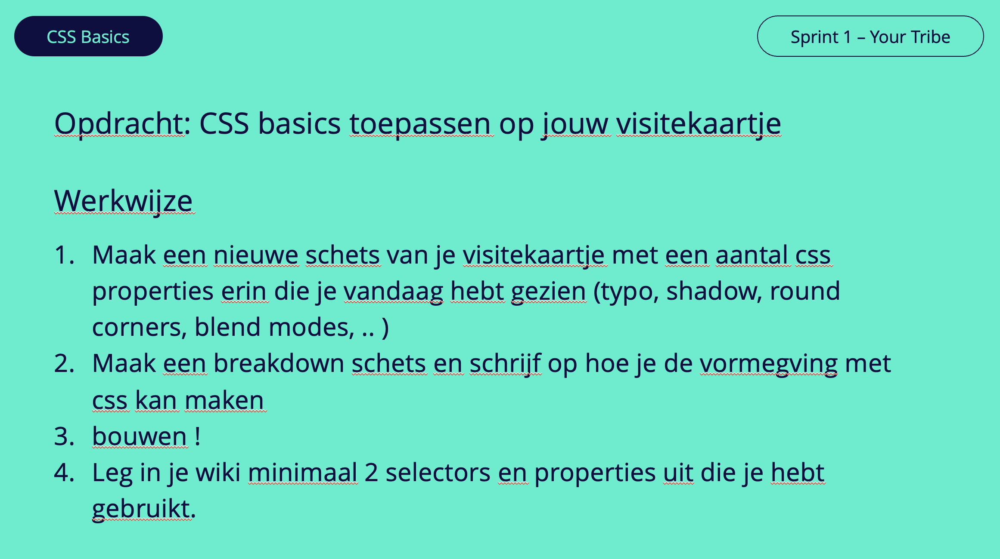

# Your Tribe - CSS Basics

Pas CSS Basics toe op je visistekaartje

## Context

Deze leertaak hoort bij sprint 1 Your Tribe. Dit is een deeltaak die je individueel uitvoert.

In het college S01W1-04 CSS Basics wordt behandeld hoe je CSS Selectoren en properties kan toepassen om een bestaand visitekaartje aan te passen.

## Doel van deze opdracht

Je leert hoe je experimenteren met (nieuwe) CSS features en daarmee (on)mogelijkheden van CSS beter kennen.

## Werkwijze

*Hoe pak je dit aan, in welke fases van de DLC*

Deze opdracht gaat over deze fases van de DLC: [ontwerpen](#ontwerpen), [bouwen](#bouwen) en [integreren](#integreren) 

### Ontwerpen
In de workshop *CSS Basics* heb je een aantal inspirerende voorbeelden gezien van wat mogelijk is met CSS. Ontwerp en maak een nieuwe versie van je visitekaartje en probeer hierbij, net als bij de voorbeelden is gedaan, out-of-the-box te denken. 

#### Aanpak

1. Schets een aantal variaties van jou visitekaartje
2. Kies de schets die jij het beste vindt

#### Materiaal 

- [CSS Text Effects](https://freefrontend.com/css-text-effects/)
- [Card Stack Effects](https://tympanus.net/codrops/2015/10/28/effect-ideas-for-card-stacks/)
- [Creative Link Effects](https://tympanus.net/codrops/2013/08/06/creative-link-effects/)

### Bouwen
In de bouwfase werk je jouw gekozen schets, zo goed mogelijk, uit in HTML, CSS en eventueel JavaScript.

#### Aanpak

1. Fork deze repository en clone de code naar je computer met de Github-desktop app
2. Open de geforkte repository folder in je code editor naar voorkeur (tip: momenteel gebruiken de meeste docenten [Visual Studio Code](https://code.visualstudio.com/))
3. Bekijk onderstaande bronnen en zoek uit welke CSS properties je nodig hebt om jou schets uit te kunnen werken
4. Pas deze CSS properties aan of voeg ze toe aan de CSS stylesheetWerk
5. Varieer in de CSS selectoren die je gebruikt (probeer CSS classes te voorkomen)

#### Materiaal 

- [MDN Styling Text](https://developer.mozilla.org/en-US/docs/Learn/CSS/Styling_text/Fundamentals)
- [MDN Background](https://developer.mozilla.org/en-US/docs/Web/CSS/background)
- [MDN Box Model](https://developer.mozilla.org/en-US/docs/Web/CSS/CSS_Box_Model)
- [MDN Position](https://developer.mozilla.org/en-US/docs/Web/CSS/position)
- [Transform, Transition & Animation](https://dev.to/moreno8423/css-transforms-transitions-and-animations-2m7d)
- [CSS diner](https://flukeout.github.io/)
- [MDN selectoren](https://developer.mozilla.org/en-US/docs/Learn/CSS/Building_blocks/Selectors)
- [Tips & Trics using pseudo-classes](https://codeburst.io/css-tips-and-tricks-using-pseudo-class-fa83248bb6e0)
- [Creative button styles with pseudo](https://tympanus.net/Development/CreativeButtons/)
- [CREATIVE LINK EFFECTS](https://tympanus.net/codrops/2013/08/06/creative-link-effects/)

### Integreren
Uitleg..

#### Aanpak

1. ...
2. ...

#### Materiaal 

- [bron]
- [bron]
- 

## Criteria

Focus sprint # - De focus van deze sprint ligt op ...

Deze deeltaak hoort bij het gedragscriterium:  
...

Deze opdracht is done als:

- [ ] ...
- [ ] ...
- [ ] ...

